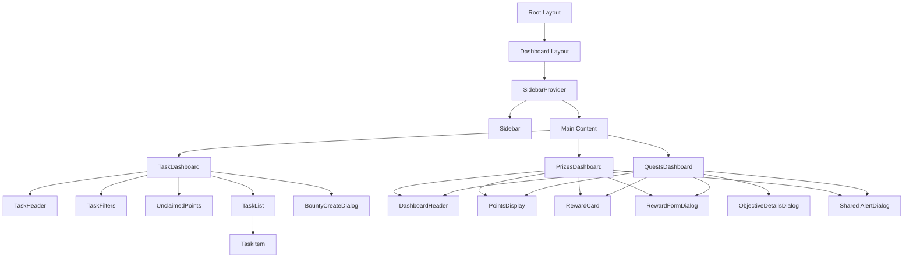

# Architectural Audit Results: Inaam Client

This document evaluates the architectural patterns, component hierarchies, and optimization opportunities identified within the `apps/client` codebase.

## Summary Metrics
- **Total Components**: ~36
- **UI Primitives**: 12
- **Feature Components**: 18
- **Layout/Shared Components**: 6

---

## Component Hierarchy Map

---

## Potential Components (Missing Abstractions)

| Component | Reason | Target Location |
| :--- | :--- | :--- |
| `EmptyState` | Duplicated "No data" UI in `QuestsDashboard` and `PrizesDashboard` with icon/title/desc. | `components/shared/EmptyState.tsx` |
| `DashboardLoader` | Similar loading spinner and text patterns across all three dashboards. | `components/shared/DashboardLoader.tsx` |
| `StatusError` | Inconsistent error display and retry logic; currently implemented ad-hoc. | `components/shared/StatusError.tsx` |
| `PageShell` | Common layout container with `pb-20 lg:pb-8` and `px-8` padding repeated. | `components/layout/PageShell.tsx` |

---

## Logic Extraction (Suggested Hooks)

### 1. `useRewards(type: RewardType)`
- **Logic**: Fetching rewards, filtering by type, and fetching nested tasks for each reward.
- **Current Duplication**: Identical logic in `QuestsDashboard.tsx` and `PrizesDashboard.tsx`.

### 2. `useRewardActions()`
- **Logic**: Managing the state and execution of `deleteReward` and `claimReward` actions, including loading/error states for those specific actions.
- **Current Duplication**: Repeated in both reward dashboards.

### 3. `useTasks()`
- **Logic**: Orchestrates fetching all tasks, filtering them based on search/status, and handling the optimistic update for completion.
- **Current Home**: Mixed within the 136 lines of `TaskDashboard.tsx`.

---

## State Management & Error Handling

- **Global Sync**: The use of `CustomEvent("refreshPoints")` is a clean, decoupled way to sync points across the sidebar and dashboards without a heavy global store.
- **Error Fragmentation**: `TaskDashboard` replaces the entire page with an error view, while others use inline alerts. 
- **Recommendation**: Standardize on a "Result-based" UI pattern where errors are contained within the content area, preserving the layout (sidebar/header).

---

## Refactoring Roadmap

- [ ] **Phase 1: Shared UI**: Implement `EmptyState` and `DashboardLoader` to clean up dashboard files.
- [ ] **Phase 2: Hook Extraction**: Create `useRewards` to remove ~100 lines of duplicated logic from reward dashboards.
- [ ] **Phase 3: Standardize Actions**: Implement `useRewardActions` to unify deletion and claiming flows.
- [ ] **Phase 4: Shell Abstraction**: Wrap dashboard content in a `PageShell` to ensure consistent spacing across all features.
