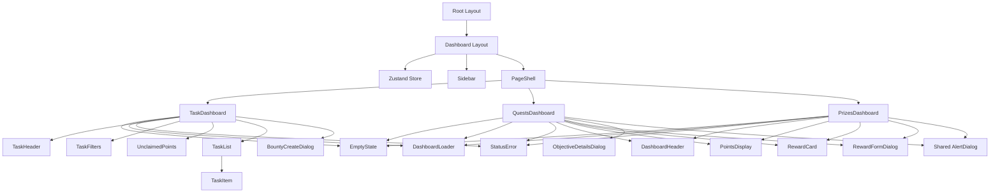

# Architectural Audit Results: Inaam Client

This document evaluates the architectural patterns, component hierarchies, and optimization opportunities identified within the `apps/client` codebase.

## Summary Metrics
- **Total Components**: ~36
- **UI Primitives**: 12
- **Feature Components**: 18
- **Layout/Shared Components**: 6

---

## Component Hierarchy Map

---

## Potential Components (Implemented Abstractions)

| Component | Reason | Location |
| :--- | :--- | :--- |
| `EmptyState` | Standardized "No data" UI for all dashboards. | `components/shared/EmptyState.tsx` |
| `DashboardLoader` | Unified loading state across features. | `components/shared/DashboardLoader.tsx` |
| `StatusError` | Standardized error display with retry logic. | `components/shared/StatusError.tsx` |
| `PageShell` | Common layout container for consistent spacing. | `components/layout/PageShell.tsx` |

---

## Logic Extraction (Hooks Implemented)

### 1. `useRewards(type: RewardType)`
- **Logic**: Centralized fetching and filtering of rewards and their objectives.
- **Location**: `hooks/useRewards.ts`

### 2. `useRewardActions()`
- **Logic**: Unifies reward deletion and claiming flows with loading states.
- **Location**: `hooks/useRewardActions.ts`

### 3. `useTasks()`
- **Logic**: Orchestrates task fetching, filtering, and optimistic completion.
- **Location**: `hooks/useTasks.ts`

---

## State Management & Error Handling

- **Global Store (Zustand)**: Migrated from `SidebarContext` and custom events to a centralized Zustand store (`hooks/store.ts`).
- **Sync Logic**: Managed via `useSidebarInit` and direct store updates, reducing dependency on DOM events.
- **Standardized Errors**: All dashboards now use the `StatusError` component, preserving the application shell during failures.

