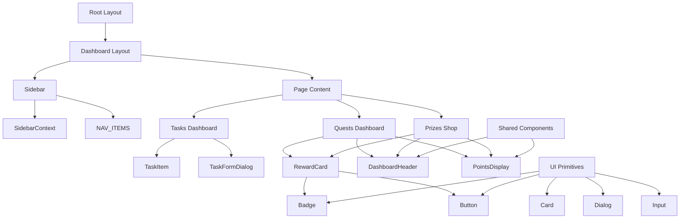

# Client Component Map: Inaam

This document maps the component hierarchy and data flow within the Inaam client application.

## Component Hierarchy
 

---

## Key Components

### 1. Layout Components
| Component | Responsibility | Props |
| :--- | :--- | :--- |
| `Sidebar` | Primary navigation, desktop sidebar, and mobile bottom bar. | `none` (uses `useSidebar`) |
| `DashboardHeader` | Reusable header with title, description, and action slot. | `title`, `description`, `children` |

### 2. Feature Components (Rewards)
| Component | Responsibility | Props |
| :--- | :--- | :--- |
| `QuestsDashboard` | Container for Quests. Handles data fetching and sorting. | `none` |
| `PrizesDashboard` | Container for Prizes. Handles data fetching and redemption. | `none` |
| `RewardCard` | Displays individual reward details (Quest/Prize). | `reward`, `onClick` |
| `PointsDisplay` | Shows the user's current point balance. | `none` (fetches balance) |

### 3. Feature Components (Tasks)
| Component | Responsibility | Props |
| :--- | :--- | :--- |
| `TaskDashboard` | Lists all Bounties and allows creation/edit. | `none` |
| `TaskItem` | Displays an individual task/bounty. | `task`, `onUpdate`, `onDelete` |

### 4. UI Primitives (`components/ui`)
- **`Button`**: Standardized button with variants (primary, ghost, destructive).
- **`Card`**: Base container for displaying content in a structured way.
- **`Dialog` / `AlertDialog`**: Used for modals and confirmation prompts.

---

## Data Flow & State Sharing

### 1. Global State
- **`SidebarContext`**: Manages the open/collapsed state of the sidebar across the layout and header.
- **Points Balance**: Syncs across components (like `PointsDisplay`) using a custom event `refreshPoints`.

### 2. Prop Drilling vs. Context
- **Prop Drilling**: Minimal. Most data is fetched at the container level (`RewardsOverview`, `TaskDashboard`) and passed down to children (`RewardCard`, `TaskItem`).
- **Context**: Used only for layout-level UI state (`Sidebar`).

### 3. Client vs. Server Components
- **Client Components** (`"use client"`): Required for all interactive elements, dialogs, and components using hooks (`useState`, `useEffect`).
- **Server Components**: Used for static parts of the layouts and initial page wrappers.

---

## Interaction Patterns

- **Dialogs**: All CRUD operations (Create/Edit Reward, Task) happen inside Dialog components to keep the main view clean.
- **Confirmations**: Significant actions (Delete Task, Claim Reward) trigger an `AlertDialog` for safety.
- **Animations**: `framer-motion` (via `motion/react`) is used for sidebar transitions and active link indicators.
