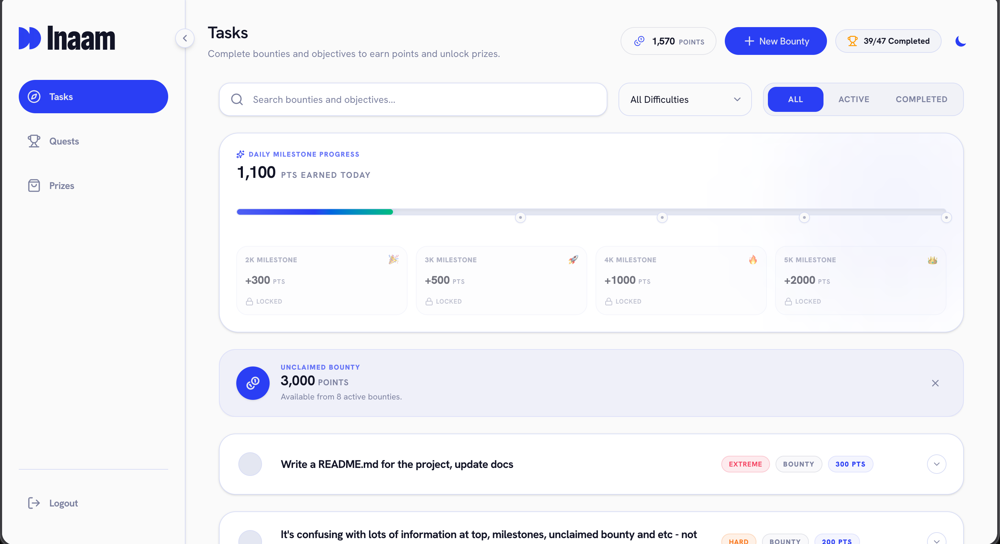
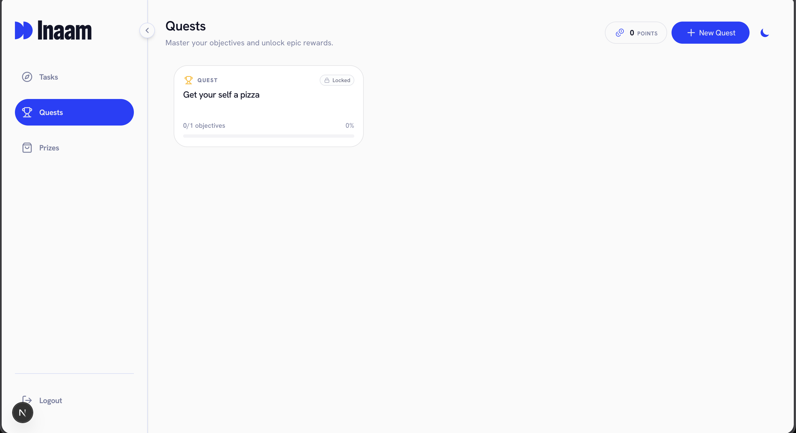
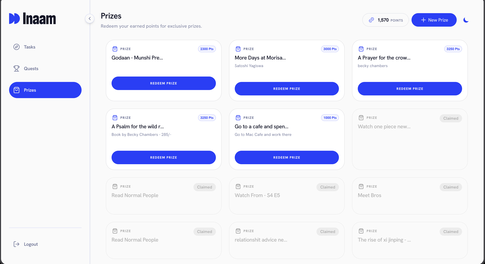

# Inaam

A lightweight Progressive Web Application (PWA) designed for managing bounty-based prize rewards and opening objective-linked quests.

---

## 📸 Screenshots

| Dashboard & Bounties | Quests & Objectives | Prizes Shop |
| :---: | :---: | :---: |
|  |  |  |

---

## 🛠️ Tech Stack

### Frontend
* **Framework**: Next.js 16 (App Router) & React 19 (Server & Client Components)
* **Language**: TypeScript
* **Styling**: Tailwind CSS v4 & Vanilla CSS variables
* **Animations**: Motion (Framer Motion) & lucide-react icons
* **State Management**: Zustand & React Context

### Backend
* **Framework**: FastAPI (Python)
* **Web Server**: Uvicorn
* **Database Driver / ORM**: Async SQLAlchemy 2.0 (Asyncpg)
* **Migrations**: Alembic
* **Validation**: Pydantic v2

### Database & Infra
* **Database**: PostgreSQL (Docker-backed)
* **Containerisation**: Docker & Docker Compose (`infra/docker-compose.local.yml`)

---

## ✨ Features

* **Multi-User Account Separation**: Cryptographic and logic database gating ensuring users only view and edit their own tasks, rewards, and transaction ledgers.
* **Quest-Linked Objectives**: Group specific task Objectives under a parent Quest. Unlocks and tracks progress in real-time, allowing the quest to be claimed at 100% completion.
* **Independent Bounties**: One-off or recurring tasks that grant points directly upon completion.
* **Recurring Tasks**: Configure Bounties to repeat on specific days of the week, automatically resetting based on local timezone offsets.
* **Prizes Shop**: Spend points earned from completing Bounties and Objectives on custom prizes.
* **Compounding Daily Milestone Bonuses**: Awards points automatically on crossing daily point totals:
  * **2,000 Points**: +300 points bonus
  * **3,000 Points**: +500 points bonus
  * **4,000 Points**: +1,000 points bonus
  * **5,000 Points**: +2,000 points bonus
* **Task Undo (Uncompletion)**: Revert completed tasks, automatically deducting points and deleting any earned milestone bonus transactions.
* **Progressive Web App (PWA)**: Desktop/mobile install support, custom splash icons, offline manifests, and badging.

---

## 🚀 Getting Started

### Prerequisites
* [Docker & Docker Compose](https://www.docker.com/)
* [Bun](https://bun.sh/) (or Node.js)
* [uv](https://github.com/astral-sh/uv) (or Python 3.11+)

### Local Development Setup

1. **Spin up the Database**:
   ```bash
   make up
   ```

2. **Run Backend Server**:
   ```bash
   make dev-server
   ```
   The FastAPI swagger docs will be available at `http://localhost:8000/docs`.

3. **Run Frontend Web App**:
   ```bash
   make dev-web
   ```
   Open `http://localhost:3000` in your browser.

### Database Migrations
To generate a new Alembic migration:
```bash
make db-migrate m="migration_message"
```
To apply migrations:
```bash
make db-upgrade
```

### Running Tests
To execute backend integration tests:
```bash
make test
```

---

## 🌐 App URLs
* **Frontend Development**: `http://localhost:3000`
* **Backend API Development**: `http://localhost:8000`
* **Production App**: `https://inaam.dhanush.codes/`

---

## 🤝 Connect With Me

* **GitHub**: [@dhanushdotcodes](https://github.com/dhanushdotcodes)
* **Email**: [dhanushd.work@gmail.com](mailto:dhanushd.work@gmail.com)
* **LinkedIn**: [https://www.linkedin.com/in/dhanushdotcodes/](https://www.linkedin.com/in/dhanushdotcodes/)
* **Twitter/X**: [https://x.com/dhanushdotcodes](https://x.com/dhanushdotcodes)
